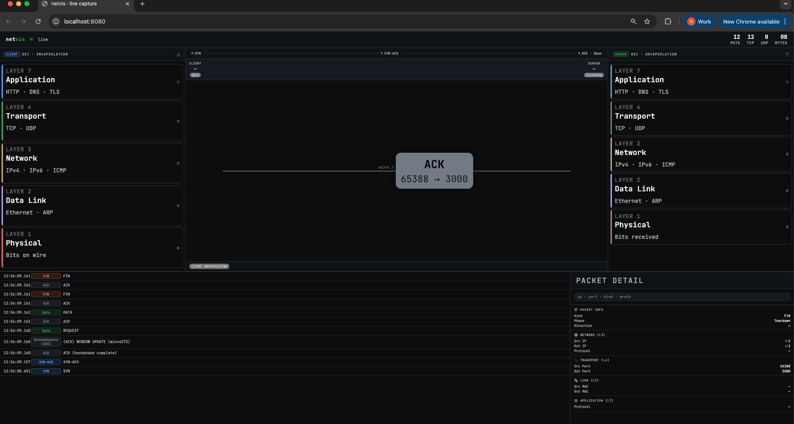

# PacketScope

A real-time network packet inspector that captures TCP traffic on a given interface and streams parsed events to a browser via WebSocket.

Built with Go + BPF on macOS/BSD.

---

## Demo

```
sudo go run . en0 3000
```

Open `http://localhost:8080` — packets flow in live as they're captured.

---

## How it works

```
Network Interface
      │
      ▼
  BPF (kernel)          ← filters raw frames
      │
      ▼
  captureLoop()         ← reads & parses packets in Go
      │
      ▼
  Hub.broadcastPaced()  ← rate-limits event fan-out
      │
      ▼
  WebSocket /ws         ← streams JSON events to browser
      │
      ▼
  Browser UI            ← served from ./static
```

---

## Requirements

- macOS or BSD (uses `/dev/bpf*`)
- Go 1.21+
- `sudo` — BPF requires root

---

## Usage

```bash
sudo go run . <interface> <port>
```

| Argument      | Default | Description                        |
|---------------|---------|------------------------------------|
| `<interface>` | `lo0`   | Network interface to capture on    |
| `<port>`      | `3000`  | TCP port to filter traffic for     |

### Examples

```bash
# Capture localhost traffic on port 3000
sudo go run . lo0 3000

# Capture on Wi-Fi interface, watching port 8080
sudo go run . en0 8080

# Use defaults (lo0, port 3000)
sudo go run .
```

---

## Permissions

BPF devices require root on macOS. If you'd rather not run the whole binary as root, you can grant access to the BPF device directly:

```bash
sudo chmod o+r /dev/bpf*
```

> ⚠️ This opens BPF to all users on the machine — only do this on a dev machine.

---

## Platform

| OS      | Supported |
|---------|-----------|
| macOS   | ✅        |
| Linux   | ❌ (uses `AF_PACKET`, not BPF) |

Linux support would require replacing the BPF layer with `AF_PACKET` or `libpcap`.

